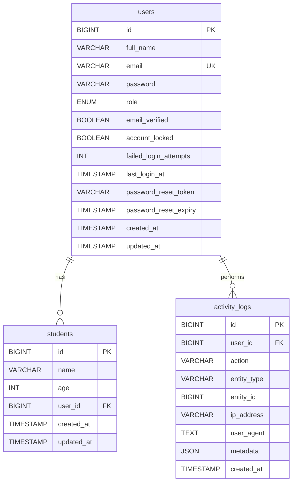

# Database Schema Documentation

## Overview

SpringPro uses MySQL 8.0 as the primary database with Spring Data JPA for ORM. The schema is designed to support user authentication, role-based access control, student management, and activity tracking.

---

## Entity Relationship Diagram



---

## Table: `users`

Stores user account information and authentication data.

### Schema

```sql
CREATE TABLE users (
    id BIGINT PRIMARY KEY AUTO_INCREMENT,
    full_name VARCHAR(255) NOT NULL,
    email VARCHAR(255) UNIQUE NOT NULL,
    password VARCHAR(255) NOT NULL,
    role ENUM('STUDENT', 'INSTRUCTOR', 'ADMIN') NOT NULL DEFAULT 'STUDENT',
    email_verified BOOLEAN DEFAULT FALSE,
    account_locked BOOLEAN DEFAULT FALSE,
    failed_login_attempts INT DEFAULT 0,
    last_login_at TIMESTAMP NULL,
    password_reset_token VARCHAR(255) NULL,
    password_reset_expiry TIMESTAMP NULL,
    created_at TIMESTAMP DEFAULT CURRENT_TIMESTAMP,
    updated_at TIMESTAMP DEFAULT CURRENT_TIMESTAMP ON UPDATE CURRENT_TIMESTAMP,
    
    INDEX idx_email (email),
    INDEX idx_role (role),
    INDEX idx_created_at (created_at),
    INDEX idx_password_reset_token (password_reset_token)
) ENGINE=InnoDB DEFAULT CHARSET=utf8mb4 COLLATE=utf8mb4_unicode_ci;
```

### Field Descriptions

| Field | Type | Constraints | Description |
|-------|------|-------------|-------------|
| `id` | BIGINT | PRIMARY KEY, AUTO_INCREMENT | Unique user identifier |
| `full_name` | VARCHAR(255) | NOT NULL | User's full name |
| `email` | VARCHAR(255) | UNIQUE, NOT NULL | User's email address (used for login) |
| `password` | VARCHAR(255) | NOT NULL | BCrypt hashed password |
| `role` | ENUM | NOT NULL | User role: STUDENT, INSTRUCTOR, or ADMIN |
| `email_verified` | BOOLEAN | DEFAULT FALSE | Whether email has been verified |
| `account_locked` | BOOLEAN | DEFAULT FALSE | Account lock status (after failed login attempts) |
| `failed_login_attempts` | INT | DEFAULT 0 | Counter for failed login attempts |
| `last_login_at` | TIMESTAMP | NULL | Timestamp of last successful login |
| `password_reset_token` | VARCHAR(255) | NULL | Token for password reset (UUID) |
| `password_reset_expiry` | TIMESTAMP | NULL | Expiration time for reset token (1 hour) |
| `created_at` | TIMESTAMP | DEFAULT CURRENT_TIMESTAMP | Account creation timestamp |
| `updated_at` | TIMESTAMP | ON UPDATE CURRENT_TIMESTAMP | Last update timestamp |

### Indexes

- **idx_email**: Fast lookup by email (login queries)
- **idx_role**: Filter users by role (admin dashboard)
- **idx_created_at**: Sort/filter by registration date (analytics)
- **idx_password_reset_token**: Validate reset tokens

### Sample Data

```sql
INSERT INTO users (full_name, email, password, role) VALUES
('John Doe', 'john.doe@example.com', '$2a$10$...', 'STUDENT'),
('Jane Smith', 'jane.smith@example.com', '$2a$10$...', 'INSTRUCTOR'),
('Admin User', 'admin@example.com', '$2a$10$...', 'ADMIN');
```

---

## Table: `students`

Stores student-specific information.

### Schema

```sql
CREATE TABLE students (
    id BIGINT PRIMARY KEY AUTO_INCREMENT,
    name VARCHAR(255) NOT NULL,
    age INT NOT NULL CHECK (age > 0 AND age < 150),
    user_id BIGINT NULL,
    created_at TIMESTAMP DEFAULT CURRENT_TIMESTAMP,
    updated_at TIMESTAMP DEFAULT CURRENT_TIMESTAMP ON UPDATE CURRENT_TIMESTAMP,
    
    FOREIGN KEY (user_id) REFERENCES users(id) ON DELETE SET NULL,
    INDEX idx_user_id (user_id),
    INDEX idx_name (name)
) ENGINE=InnoDB DEFAULT CHARSET=utf8mb4 COLLATE=utf8mb4_unicode_ci;
```

### Field Descriptions

| Field | Type | Constraints | Description |
|-------|------|-------------|-------------|
| `id` | BIGINT | PRIMARY KEY, AUTO_INCREMENT | Unique student identifier |
| `name` | VARCHAR(255) | NOT NULL | Student's name |
| `age` | INT | NOT NULL, CHECK (1-150) | Student's age |
| `user_id` | BIGINT | FOREIGN KEY, NULL | Reference to users table (optional) |
| `created_at` | TIMESTAMP | DEFAULT CURRENT_TIMESTAMP | Record creation timestamp |
| `updated_at` | TIMESTAMP | ON UPDATE CURRENT_TIMESTAMP | Last update timestamp |

### Indexes

- **idx_user_id**: Link students to user accounts
- **idx_name**: Search students by name

### Relationships

- **user_id → users.id**: Optional one-to-one relationship with user account
- **ON DELETE SET NULL**: If user is deleted, student record remains but user_id is cleared

### Sample Data

```sql
INSERT INTO students (name, age, user_id) VALUES
('Alice Johnson', 20, 1),
('Bob Williams', 22, NULL),
('Charlie Brown', 19, NULL);
```

---

## Table: `activity_logs`

Tracks user actions for security and analytics.

### Schema

```sql
CREATE TABLE activity_logs (
    id BIGINT PRIMARY KEY AUTO_INCREMENT,
    user_id BIGINT NULL,
    action VARCHAR(100) NOT NULL,
    entity_type VARCHAR(50) NULL,
    entity_id BIGINT NULL,
    ip_address VARCHAR(45) NULL,
    user_agent TEXT NULL,
    metadata JSON NULL,
    created_at TIMESTAMP DEFAULT CURRENT_TIMESTAMP,
    
    FOREIGN KEY (user_id) REFERENCES users(id) ON DELETE SET NULL,
    INDEX idx_user_id (user_id),
    INDEX idx_action (action),
    INDEX idx_created_at (created_at),
    INDEX idx_entity (entity_type, entity_id)
) ENGINE=InnoDB DEFAULT CHARSET=utf8mb4 COLLATE=utf8mb4_unicode_ci;
```

### Field Descriptions

| Field | Type | Constraints | Description |
|-------|------|-------------|-------------|
| `id` | BIGINT | PRIMARY KEY, AUTO_INCREMENT | Unique log entry identifier |
| `user_id` | BIGINT | FOREIGN KEY, NULL | User who performed the action |
| `action` | VARCHAR(100) | NOT NULL | Action type (LOGIN, LOGOUT, CREATE, UPDATE, DELETE) |
| `entity_type` | VARCHAR(50) | NULL | Type of entity affected (USER, STUDENT, etc.) |
| `entity_id` | BIGINT | NULL | ID of affected entity |
| `ip_address` | VARCHAR(45) | NULL | User's IP address (supports IPv6) |
| `user_agent` | TEXT | NULL | Browser/client user agent string |
| `metadata` | JSON | NULL | Additional context (request params, changes, etc.) |
| `created_at` | TIMESTAMP | DEFAULT CURRENT_TIMESTAMP | When the action occurred |

### Indexes

- **idx_user_id**: Query logs by user
- **idx_action**: Filter by action type
- **idx_created_at**: Time-based queries (recent activity)
- **idx_entity**: Find all actions on a specific entity

### Action Types

Common action values:
- `LOGIN` - User logged in
- `LOGOUT` - User logged out
- `REGISTER` - New user registered
- `UPDATE_PROFILE` - User updated profile
- `CHANGE_PASSWORD` - Password changed
- `RESET_PASSWORD` - Password reset
- `CREATE_STUDENT` - Student record created
- `UPDATE_STUDENT` - Student record updated
- `DELETE_STUDENT` - Student record deleted
- `DELETE_USER` - User deleted (admin action)
- `LOCK_ACCOUNT` - Account locked (admin action)
- `UNLOCK_ACCOUNT` - Account unlocked (admin action)

### Sample Data

```sql
INSERT INTO activity_logs (user_id, action, entity_type, entity_id, ip_address, metadata) VALUES
(1, 'LOGIN', NULL, NULL, '192.168.1.100', '{"success": true}'),
(1, 'UPDATE_PROFILE', 'USER', 1, '192.168.1.100', '{"changed_fields": ["full_name"]}'),
(2, 'CREATE_STUDENT', 'STUDENT', 5, '192.168.1.101', '{"student_name": "Alice Johnson"}');
```

---

## Data Retention Policy

| Table | Retention Period | Cleanup Strategy |
|-------|------------------|------------------|
| `users` | Indefinite (while active) | Soft delete with 30-day recovery, then hard delete |
| `students` | Indefinite | Manual deletion only |
| `activity_logs` | 90 days | Automated cleanup job (daily) |

---

## Migration Strategy

### Development
- **Hibernate DDL Auto**: `spring.jpa.hibernate.ddl-auto=update`
- Automatically updates schema based on entity changes
- Suitable for rapid development

### Production
- **Migration Tool**: Flyway or Liquibase
- **Version Control**: All schema changes tracked in migration files
- **Process**:
  1. Create migration file (e.g., `V1__initial_schema.sql`)
  2. Test in staging environment
  3. Apply to production during maintenance window
  4. Rollback plan for each migration

### Sample Flyway Migration

**V1__initial_schema.sql**:
```sql
CREATE TABLE users (
    id BIGINT PRIMARY KEY AUTO_INCREMENT,
    full_name VARCHAR(255) NOT NULL,
    email VARCHAR(255) UNIQUE NOT NULL,
    password VARCHAR(255) NOT NULL,
    role ENUM('STUDENT', 'INSTRUCTOR', 'ADMIN') NOT NULL,
    created_at TIMESTAMP DEFAULT CURRENT_TIMESTAMP,
    updated_at TIMESTAMP DEFAULT CURRENT_TIMESTAMP ON UPDATE CURRENT_TIMESTAMP
);
```

**V2__add_user_security_fields.sql**:
```sql
ALTER TABLE users
ADD COLUMN email_verified BOOLEAN DEFAULT FALSE,
ADD COLUMN account_locked BOOLEAN DEFAULT FALSE,
ADD COLUMN failed_login_attempts INT DEFAULT 0,
ADD COLUMN last_login_at TIMESTAMP NULL,
ADD COLUMN password_reset_token VARCHAR(255) NULL,
ADD COLUMN password_reset_expiry TIMESTAMP NULL;

CREATE INDEX idx_password_reset_token ON users(password_reset_token);
```

---

## Backup Strategy

### Automated Backups
- **Frequency**: Daily at 2:00 AM UTC
- **Retention**: 30 days
- **Storage**: AWS S3 / Google Cloud Storage
- **Type**: Full database dump

### Backup Command (MySQL)
```bash
mysqldump -u root -p springpro_db > backup_$(date +%Y%m%d).sql
```

### Restore Command
```bash
mysql -u root -p springpro_db < backup_20251210.sql
```

---

## Performance Optimization

### Query Optimization

**Slow Query Example** (without index):
```sql
SELECT * FROM users WHERE email = 'john.doe@example.com';
-- Execution time: ~500ms on 1M rows
```

**Optimized Query** (with index):
```sql
-- With idx_email index
SELECT * FROM users WHERE email = 'john.doe@example.com';
-- Execution time: ~5ms on 1M rows
```

### Index Strategy

1. **Primary Keys**: Auto-indexed, used for joins
2. **Foreign Keys**: Indexed for join performance
3. **Unique Constraints**: Indexed for uniqueness checks
4. **Search Fields**: Index frequently queried fields (email, role)
5. **Composite Indexes**: For multi-column queries (entity_type + entity_id)

### Connection Pooling

**application.properties**:
```properties
spring.datasource.hikari.maximum-pool-size=10
spring.datasource.hikari.minimum-idle=5
spring.datasource.hikari.connection-timeout=30000
spring.datasource.hikari.idle-timeout=600000
spring.datasource.hikari.max-lifetime=1800000
```

---

## Security Considerations

### Password Storage
- **Algorithm**: BCrypt with strength 10
- **Salt**: Automatically generated per password
- **Never** store plain text passwords
- **Never** log passwords

### SQL Injection Prevention
- **JPA/Hibernate**: Parameterized queries by default
- **Native Queries**: Always use parameter binding
- **Input Validation**: Validate all user input

**Bad Example** (vulnerable):
```java
// DON'T DO THIS
String query = "SELECT * FROM users WHERE email = '" + email + "'";
```

**Good Example** (safe):
```java
// DO THIS
@Query("SELECT u FROM User u WHERE u.email = :email")
User findByEmail(@Param("email") String email);
```

### Sensitive Data
- **Password**: BCrypt hashed
- **Reset Tokens**: UUID, expires in 1 hour
- **Database Credentials**: Environment variables, never in code
- **Backups**: Encrypted at rest

---

## Monitoring Queries

### Slow Query Log

Enable in MySQL:
```sql
SET GLOBAL slow_query_log = 'ON';
SET GLOBAL long_query_time = 1; -- Log queries > 1 second
```

### Common Analytics Queries

**User Growth**:
```sql
SELECT DATE(created_at) as date, COUNT(*) as registrations
FROM users
WHERE created_at >= DATE_SUB(NOW(), INTERVAL 30 DAY)
GROUP BY DATE(created_at)
ORDER BY date;
```

**Active Users Today**:
```sql
SELECT COUNT(DISTINCT user_id) as active_users
FROM activity_logs
WHERE created_at >= CURDATE();
```

**Users by Role**:
```sql
SELECT role, COUNT(*) as count
FROM users
GROUP BY role;
```

**Failed Login Attempts**:
```sql
SELECT user_id, COUNT(*) as attempts
FROM activity_logs
WHERE action = 'LOGIN' 
  AND JSON_EXTRACT(metadata, '$.success') = false
  AND created_at >= DATE_SUB(NOW(), INTERVAL 1 HOUR)
GROUP BY user_id
HAVING attempts >= 5;
```

---

## Future Schema Enhancements

### Planned Tables

**email_queue** (for async email sending):
```sql
CREATE TABLE email_queue (
    id BIGINT PRIMARY KEY AUTO_INCREMENT,
    recipient VARCHAR(255) NOT NULL,
    subject VARCHAR(255) NOT NULL,
    body TEXT NOT NULL,
    status ENUM('PENDING', 'SENT', 'FAILED') DEFAULT 'PENDING',
    attempts INT DEFAULT 0,
    created_at TIMESTAMP DEFAULT CURRENT_TIMESTAMP,
    sent_at TIMESTAMP NULL,
    INDEX idx_status (status)
);
```

**sessions** (for session management):
```sql
CREATE TABLE sessions (
    id VARCHAR(255) PRIMARY KEY,
    user_id BIGINT NOT NULL,
    ip_address VARCHAR(45),
    user_agent TEXT,
    created_at TIMESTAMP DEFAULT CURRENT_TIMESTAMP,
    expires_at TIMESTAMP NOT NULL,
    FOREIGN KEY (user_id) REFERENCES users(id) ON DELETE CASCADE,
    INDEX idx_user_id (user_id),
    INDEX idx_expires_at (expires_at)
);
```

**courses** (for educational content):
```sql
CREATE TABLE courses (
    id BIGINT PRIMARY KEY AUTO_INCREMENT,
    title VARCHAR(255) NOT NULL,
    description TEXT,
    instructor_id BIGINT NOT NULL,
    created_at TIMESTAMP DEFAULT CURRENT_TIMESTAMP,
    FOREIGN KEY (instructor_id) REFERENCES users(id) ON DELETE CASCADE
);
```
